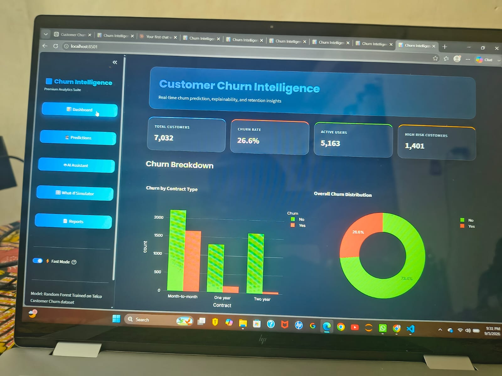
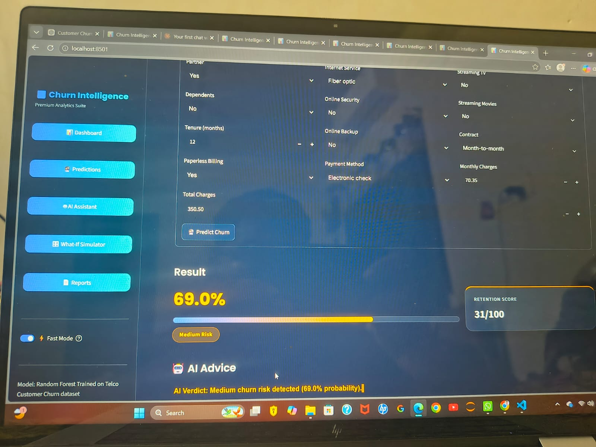
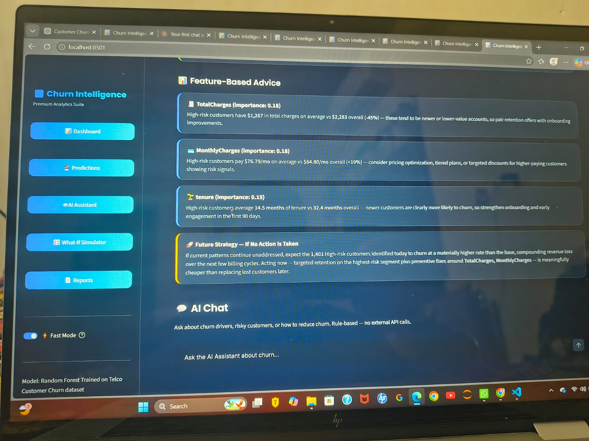
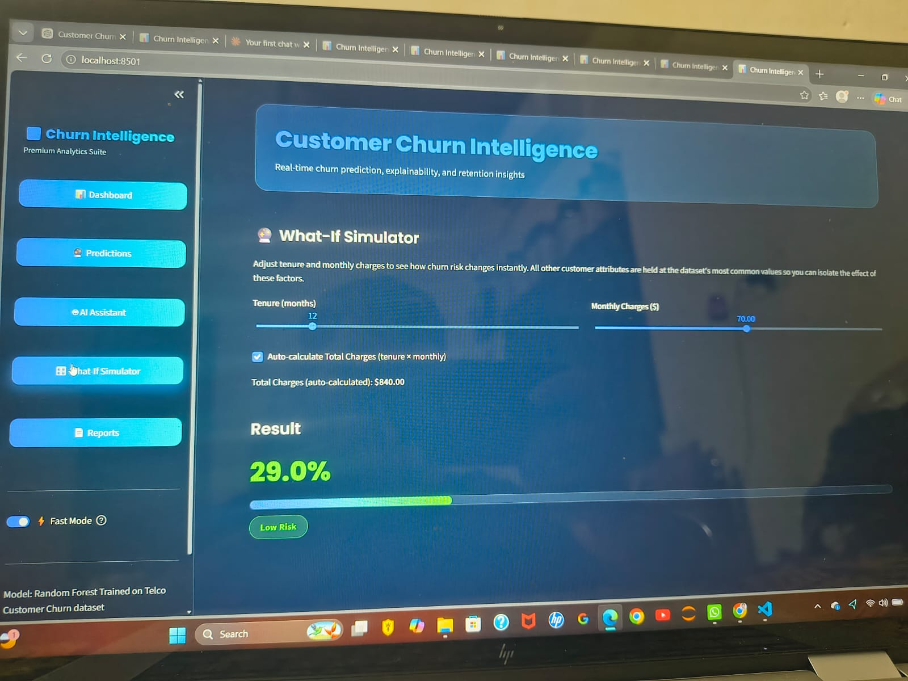
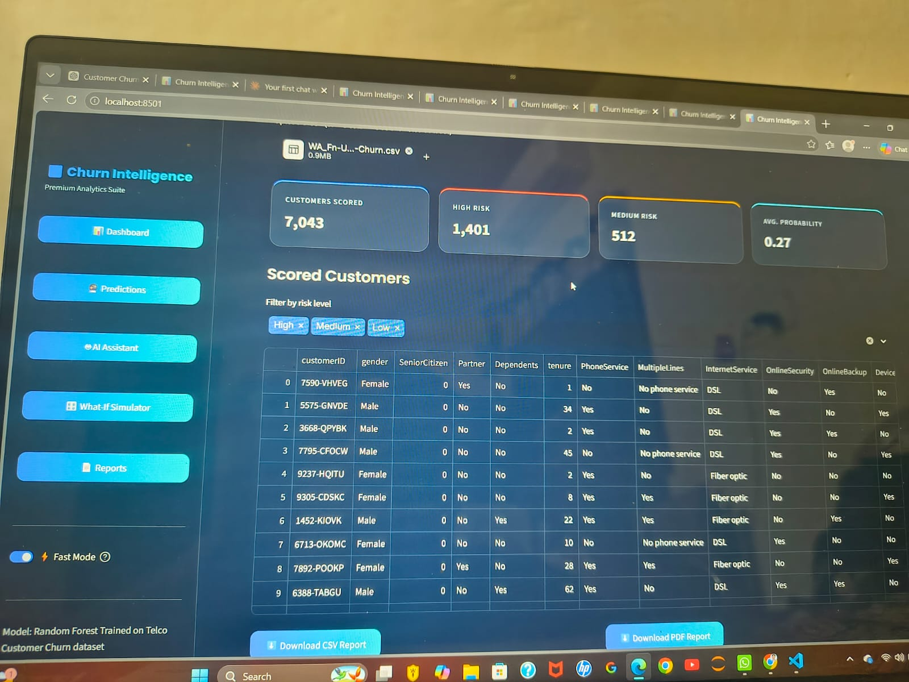

# Customer Churn Intelligence Platform

A Streamlit app upgrading your churn model into a full dashboard + prediction
+ explainability + segmentation + forecasting + recommendation system.

## Folder structure

```
churn_intel/
├── app.py                 <- the whole app (single file, 5 pages)
├── model.pkl               <- your trained Random Forest (already included)
├── label_encoders.pkl      <- your trained encoders (already included)
├── requirements.txt
└── data/
    └── WA_Fn-UseC_-Telco-Customer-Churn.csv   <- powers the dashboard/segmentation
```

## Setup

```
cd churn_intel
pip install -r requirements.txt
streamlit run app.py
```

It will open automatically in your browser (usually `http://localhost:8501`).

## What's on each page

1. **Dashboard** — total/active/churned customers, churn rate, bar/pie charts
   by contract/internet/gender, a tenure-based churn trend line, and global
   feature importance.
2. **Predict a Customer** — fill in one customer's details, get probability,
   %, risk level (Low/Medium/High), retention score, top reasons (via SHAP
   if installed, otherwise feature importance), and matching recommendations.
3. **Bulk Upload & Insights** — upload any CSV with the same columns, get
   instant scoring for every row, filters by risk level, CSV/PDF download,
   auto-generated insight sentences, and a high-risk alert list.
4. **Segmentation** — KMeans clustering into Loyal / At-Risk / New segments,
   visualized on a bubble scatter plot.
5. **Forecast** — a trend projection using tenure cohorts as a time proxy
   (see the in-app warning — this dataset has no real calendar timeline, so
   treat the forecast as directional, not precise).

## Notes on the explainability & PDF features

- If `shap` isn't installed, the app automatically falls back to global
  feature importance instead of per-customer SHAP values — it won't crash.
- If `fpdf2` isn't installed, the PDF download button simply won't appear;
  the CSV download always works.

## Extending it further

- Swap the bundled CSV for your own to change what the Dashboard/Segmentation
  pages show.
- The `SUGGESTION_RULES` dictionary near the top of `app.py` is where you add
  or edit retention actions per feature.
- To connect email/SMS alerts for High-risk customers, the alert table on the
  Bulk Upload page is the natural place to add a "Send Alert" button wired to
  an email/SMS API (Twilio, SendGrid, etc.) — not included here since it needs
  your own credentials.
  ## 📸 Screenshots

### 📊 Dashboard


### 🔮 Prediction


### 🤖 AI Advice


### ⚙️ What-If Simulator


### 📄 Reports

